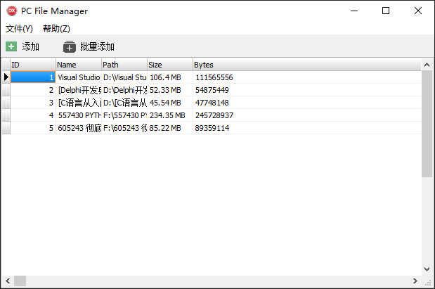

# FileManager

截图如下

ToDo

- [x] 通过拖拽添加
- [x] 通过文件MD5值校验是否重复
- [x] 保存文件信息
  
  * Name
  * Path
  * Size
  * Bytes
  * MD5
  * Creation Time
  * Last Write Time
  * Last Access Time

- [x] 右键删除记录
- [x] 通过文件夹批量添加文件
- [x] 右键打开路径
- [x] 右键删除所有记录

